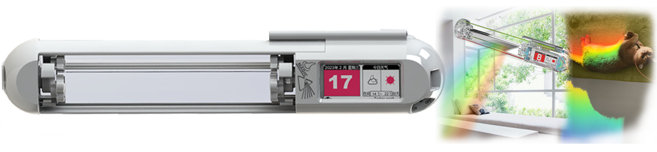
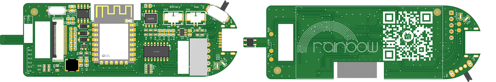
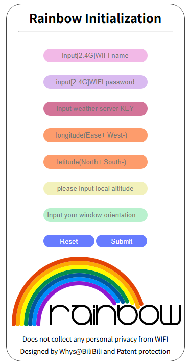
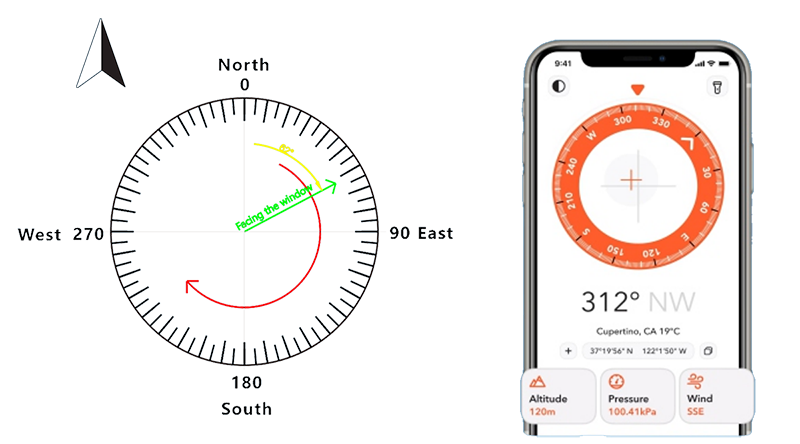
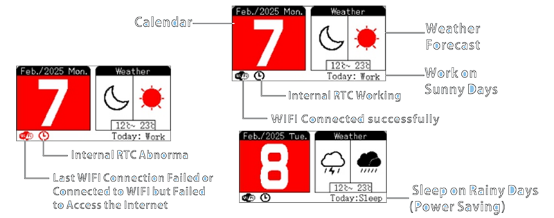

# Rainbow ESP8266

## Features



This is an ESP8266-based toy developed with the Arduino environment. It accurately calculates the position of the sun based on geographic location and time, then adjusts the prism's orientation in real time to disperse sunlight into a rainbow projected inside the room, creating a calm and pleasant atmosphere. The program includes a low-power sleep mechanism that allows it to run entirely on solar power. It can also connect to WiFi to retrieve information and display the date, weather, battery level, and configuration status on an e-paper screen.  
[Visit here for more information and a demonstration](https://www.bilibili.com/video/BV1gX4y1D7wM/?vd_source=42ecb46c8304961543d4f286cf99d5a6)

[需要中文版本资料，请点击这里访问中文仓库](https://github.com/zzwang859/ESP8266_Rainbow_zh)

## Directory Structure
```text
.
├── Rainbowv1.0_ESP8266.ino      # Arduino main program entry point
├── Libraries/                   # Archived third-party library packages
│   ├── ArduinoJson.rar
│   ├── ESP8266-Seniverse-master.zip
│   └── NTPClient.rar
├── src/                         # Project source modules
│   ├── config.h                 # Top-level feature configuration macros
│   ├── app_types.h              # Global data structures and state enumerations
│   ├── adc/                     # ADC, battery voltage, and infrared sensor sampling
│   ├── DS1302/                  # DS1302 clock chip driver
│   ├── Epaper/                  # E-paper driver, UI refresh, and image resources
│   ├── moto/                    # Stepper motor control and prism position calibration
│   ├── Sun/                     # Solar position calculation and optimal prism angle search
│   └── wifi_html/               # HTML resources for the WiFi configuration page
├── docments/                    # Project documentation/resources, including program flowcharts and finished product manual
├── Print_Step/                   # Enclosure source files for 3D printing
├── PCB_SCH/                     # Schematic and PCB files
└── images/                      # Finished product photos and actual effect images
```

## Code Deployment Instructions

### Main Program
`Rainbowv1.0_ESP8266.ino` is the main entry point of the Arduino sketch. It contains `setup()`, `loop()`, and the project-level state machine logic. It coordinates the following processes:

- Determine the reset source after power-on/deep-sleep wake-up.
- Restore configuration and operating state from Flash or RTC memory.
- WiFi Station/SoftAP configuration process.
- Time synchronization among NTP, DS1302, and the local perpetual calendar.
- Retrieve weather data and select the city ID.
- Calculate the solar position, sunlight period, and optimal prism angle.
- Schedule stepper motor operations.
- Refresh e-paper display pages.
- Detect low battery and enter low-power sleep.

### Configuration and Global Types
#### `src/config.h`
This is the top-level configuration entry point for the project. The main macros include:  
- `OFFLINE_TEST`: Enables or disables offline/development test mode.
- `DEBUG_INFO_EN`: Enables or disables debug information output.
- `USE_EINK_SCREEN`: Determines whether the e-paper screen is enabled.
- `BAT_LOW_GATE`: Low-battery protection threshold.
- `EINK_MODEL`: E-paper hardware model.
- `EINK_UI_LANGUAGE`: UI language selection, configurable as Chinese or English.

*To customize the startup image, modify the array data of img_config_red &img_config_black in src/epaper/epaper_bmp.h*

### Third-Party Dependencies
The project uses the following Arduino/ESP8266 libraries:
- Libraries included with ESP8266 Arduino Core: `ESP8266WiFi`, `DNSServer`, `ESP8266WebServer`, `SPI`, and `WiFiUdp`.

Third-party library packages are stored in the `Libraries/` directory. Before compilation, make sure these libraries are correctly installed in the Arduino IDE or located in a path that the compiler can search,  
usually: `\Users\name\Documents\Arduino\libraries\ `<br>
- `ArduinoJson`
- `ESP8266_Seniverse`
- `NTPClient`

### Code Maintenance
- Modify top-level feature switches in `src/config.h` first.
- Refer to `src/app_types.h` first for global state structures.
- Hardware pin-related macros are located in the header files of their corresponding modules.

## Schematic and PCB 

The schematic and PCB files are located in `PCB_SCH/` and were designed using EasyEDA. After obtaining them, you will need to manufacture the circuit board yourself. Fortunately, only a small number of inexpensive components are required. All components use 0603 packages, so there are no demanding requirements for soldering equipment or skills. If you are in China, you can have the circuit board manufactured for free by JLCPCB.



## Enclosure and Bill of Materials
The 3D-printable enclosure files are located in the `Print_Step` directory. However, additional materials, such as stepper motors and a solar panel, are required to assemble the complete product. The list is as follows:

|Part Name| Quantity|Unit|Specifications|Notes|
|:---:|:---:|:---:|:---:|:---:|
| Enclosure| 2 |sets | PLA/PETG | 3D Printed |
| PCB| 1 |piece | Fully assembled | DIY |
| Triangular Prism| 1 |piece | 30*30*150mm | Buy |
| Solar Panel| 1|piece |90*30mm 5.5V |Buy|
| Stepper Motor| 2|pieces|28BYJ-48 DC5V | Buy|
| Battery| 2|pieces|102540 1100mAh 1.25mm*2Pin|Buy|
| Bearing| 2|pieces|10mm inner diameter, 22mm outer diameter, 8mm thickness|Buy|
| Brass Standoff| 2|pieces|M3*18mm |Buy|
| E-paper Display|1|piece| 2.13" |Buy|
| M3 Bolt|4 |pieces|M3*10mm |Buy|
| M6 Bolt|2 |pieces|M6*20mm hex socket |Buy|
| M6 Nut|2 |pieces|M6 |Buy|
| M6 Washer|2 |pieces|M6*12*1mm |Buy|

## Finished Product Installation and Setup

#### Mounting on Window Glass
1. First, determine the installation location. This toy requires a vertical window exposed to sunlight. (Horizontal skylights or sloped attic windows are not suitable for installing this toy.)
2. Be sure to clean the glass first to prevent dust or dirt from weakening the adhesive hooks.
3. Attach the adhesive hooks to the product first to ensure the spacing between the hooks is correct.
4. Peel off the backing from the hooks, press the product firmly onto the glass, and ensure that it adheres securely.
5. Remove the product from the hooks, press the hooks firmly against the glass again, and then hang the product back in place.

#### Placing on a Windowsill with Stands
The 3D printing files are located in the `Print_Step` directory, which includes files for a pair of stands that can be printed to support the device.

### Initial Setup

1. Turn on the product's power switch. Use a phone or computer to find and connect to the hotspot named rainbow. The password is 12345678.
2. Then open 192.168.4.1 in a mobile browser. The interface is shown below. Follow the on-screen instructions to enter your home WIFI name and password, the longitude, latitude, and altitude of the installation location, and the window orientation. Then click Connect.<br>

<p align="center">
  
</p><br>

+ The target WIFI network supports only 2.4 GHz. Connecting to a 5 GHz WIFI hotspot will fail. When configuring with a mobile hotspot, enable the "Maximize Compatibility" option.
+ Verify that the WIFI password is correct. Public WIFI and other hotspots that require additional authentication after connection to access the Internet are not suitable for this toy.
+ For the weather private key, enter "OFF" if you do not use the weather forecast feature. In mainland China, Seniverse is used as the third-party weather information service provider, and users can register a free account with a personal mobile phone number to obtain a private key. If the program is compiled in English, the weather forecast source is Caiyun Weather, which requires a paid subscription.

3. Longitude and latitude data must be entered in decimal format with 5–6 decimal places to provide an accurate geographic location. A more convenient method is to look up the longitude and latitude online at <https://api.map.baidu.com/lbsapi/getpoint/index.html>.<br>
If the data is in degrees-minutes-seconds format (for example, 30°20'56"), convert it to decimal format using the following formula:<br>
$$
\text{Decimal Degrees}
=
\text{Degrees}
+
\frac{\text{Minutes}}{60}
+
\frac{\text{Seconds}}{3600}
$$<br>

4. Altitude can be obtained from a map app or a third-party compass app. The altitude does not need to be precise; an error of about 100 meters has virtually no effect.
- Optional hidden settings can be appended to the altitude value for users with special application requirements. The format and descriptions of the additional settings are shown below. Square brackets around optional parameters are required, and the letters in `UTC/ADJ/NTP/LPR` are case-sensitive.  
    **Required Parameter**<br>
    - Altitude value (required)

    **Optional Parameters**<br>
    - Custom time zone, such as `[UTC+8] 、[UTC-5]` <br>
    - Coordinate system fine-tuning. To compensate for stepper motor gear error, a coordinate system adjustment setting is provided. To make the rainbow smaller and brighter (with a more concentrated beam), adjust slightly in the negative direction, for example: `[ADJ-3.0]`; to make the rainbow larger (more dispersed), adjust slightly in the positive direction, for example: `[ADJ3.0]`. The adjustment is generally within ±6 degrees. Excessive adjustment may prevent a rainbow from forming. <br>
    - Custom NTP time server, for example `[NTPntp1.aliyun.com]` <br>
    
    ```bash
    w32tm /stripchart /computer:ntp.tencent.com  # Method for checking whether an NTP server is available on Windows
    ```
    Some commonly used NTP servers are listed below:
    ```text
    ntp1.aliyun.com
    pool.ntp.org
    ntp.tencent.com
    time.cloud.tencent.com
    time.apple.com
    time.google.com (unavailable in mainland China)
    time.facebook.com (unavailable in mainland China)
    ntp.ix.ru (Moscow)
    ntp.jst.mfeed.ad.jp (Japan)
    ```

    - Custom low-battery warning voltage, for example `[LPR750]`. The valid range is 0–1024. Because the ESP8266 ADC readings are inaccurate, this parameter is provided to prevent the device from incorrectly entering low-battery sleep too early. Setting it to 0 effectively disables low-battery sleep.

5. Window orientation
      The window orientation is a numeric value. True north is 0, and the north-east-south-west-north sequence corresponds to 0–360 degrees, as shown below. Point your phone's built-in compass app toward the window; the displayed reading is the window orientation value.
      


*The longitude, latitude, altitude, and window orientation parameters can all be obtained from the phone's built-in "Compass" app. When taking measurements, place the phone flat and point it directly toward the window. (Since iOS 14, Apple's built-in "Compass" app no longer displays longitude, latitude, and altitude information. You can download a third-party "Compass" app from the App Store to obtain this information.)*

#### E-paper Display Information
<p align="center">
  
</p><br>


## ⚠️ Safety Precautions
* Before mounting the product on indoor glass, clean the glass thoroughly to prevent dust or grease from weakening the adhesive bond. 
* Do not manually rotate the product using external force, as this may break the internal gears and damage the product. 
* Do not install the product outdoors on a high-rise building, as an accidental fall could cause personal injury. 
* When the battery is depleted, charge it using a Type-C USB cable. 
* This product is not suitable for use or play by children under 9 years old. 
* This product does not concentrate light and therefore does not present a fire hazard from concentrated sunlight.
